# OpenDesign Architecture & Data Flow

OpenDesign is a fork of OpenCode, evolved into a separate product. It reuses much of OpenCode's structure (server, SDK, tooling) but introduces a different model: **directory lives at the agent level, not the project level**. Projects are logical containers; agents own filesystem context (via Git branches and Sandpack).

---

## OpenDesign vs OpenCode

| Aspect | OpenCode | OpenDesign |
|--------|----------|------------|
| **Project** | Has a worktree (directory on disk) | No directory; logical container with ID |
| **Scope of work** | One directory per project | One directory per agent |
| **Execution** | Tools run in project directory | Tools run in agent's branch checkout |
| **Analogy** | 1 OpenCode = 1 project | 1 OpenDesign project = several OpenCodes in parallel (one per agent) |

---

## OpenDesign Core Model

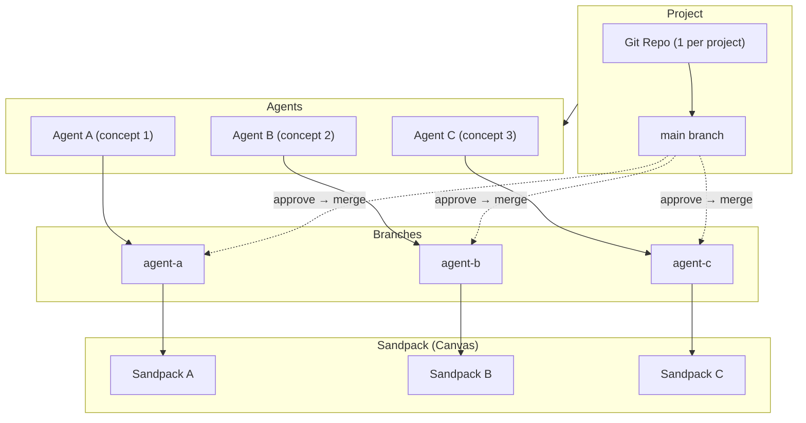

### Key Concepts

| Concept | Description |
|---------|-------------|
| **Project** | Logical container. One Git repo. No directory at project level. Identified by `projectId`. |
| **Agent** | Spawned per concept. Gets: (1) a branch in the project repo, (2) a working directory (branch checkout), (3) a Sandpack instance on the canvas, (4) tools that operate on its directory. |
| **Concept** | A distinct sub-task from the user request. Orchestrator infers concepts and spawns agents. |
| **Canvas** | UI surface displaying multiple Sandpack containers—one per active agent. |
| **Session** | Conversation context. Scoped to project (and agents). No directory at session level. |

---

## Git Model (OpenDesign)

- **1 repo per project** — all agents share the same Git repository. No worktrees.
- **1 branch per agent** — each agent works on its own branch (e.g. `agent/{agentId}`).
- **Same file tree** — all agents work on the same file structure; branches differ in content.
- **Auto-commit** — when an agent completes a task, changes are committed to its branch.
- **Rollback** — reverting an agent's work = resetting its branch to a previous commit.
- **Merge** — user approves agent results → that agent's branch merges into `main`.

---

## Merge Flow & Conflict Handling

- **Approval → merge**: User approves an agent's work → that branch merges into `main`. When all approvals are done, `main` is the unified prototype.
- **1 repo required**: Multiple repos per agent would make "unified prototype" impossible; one repo is necessary.
- **Sequential approval**: Merge one agent at a time. Each merge is against current `main`. Conflicts are resolved before the next approval.
- **Orchestrator reduces conflicts**: Scope concepts and route agents so they tend to touch different files (e.g. validation vs layout). Reduces overlap; conflicts still possible.
- **No Git worktrees**: Single checkout per agent is sufficient. (Note: the app uses "worktree" in session state to refer to the agent's working directory, not the Git worktree feature.)

### Visual Conflict Resolution (Designer-Focused)

Designers should resolve conflicts by **outcome**, not by editing code. Avoid raw code diffs and merge markers.

- **Side-by-side Sandpack previews**: When a merge conflict occurs, show two Sandpack instances—left = `main` (current prototype), right = agent branch (incoming changes). User sees the rendered behavior of both versions.
- **Choose outcome**: User selects "keep left" or "take right" based on visual comparison. System maps that to file-level resolution (ours vs theirs). No code-editing required.
- **Behavior over code**: Example—one version has an icon, the other removes it. User sees both in preview and picks which behavior to keep. The UI translates that choice into the merge resolution.

---

## Storage & Backend Layout (OpenDesign)

```
~/.opendesign/
└── projects/
    └── {projectId}/
        ├── .git/                 # Single repo for the project
        ├── main                  # main branch (unified prototype when all merged)
        └── agents/
            └── {agentId}/        # Working directory (checkout of agent's branch)
                ├── src/
                ├── ...
```

- Git repo lives at `~/.opendesign/projects/{projectId}/`.
- Each agent has a working directory = checkout of its branch.
- Tools run against that directory; Sandpack is fed file state via API.

---

## Agent Lifecycle

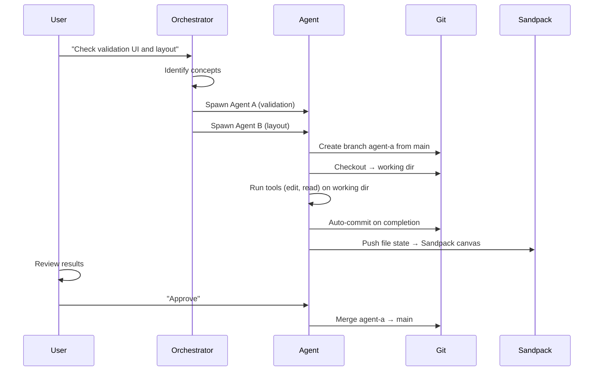

---

## Agent-Scoped Request Flow

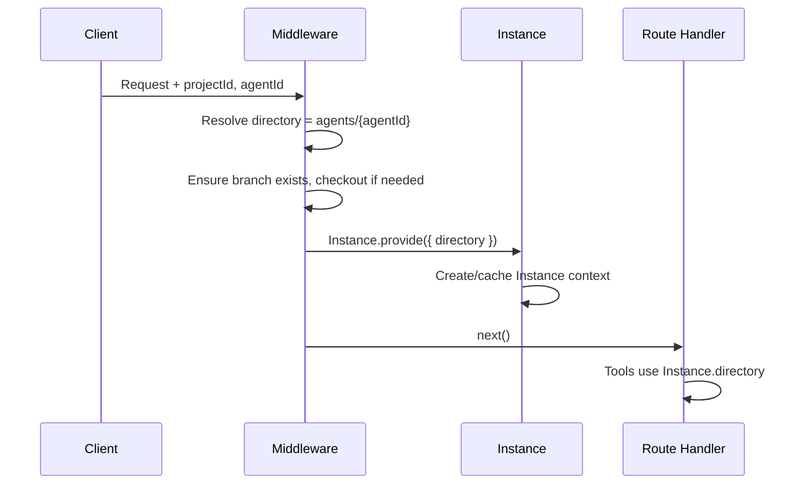

Backend reuses OpenCode's `Instance.provide({ directory })`; directory is derived from `(projectId, agentId)` instead of being project-level.

---

## Sandpack Integration

- **Backend** owns the working directory; tools (edit, read, grep) operate on it.
- **Sandpack** displays the current file tree; state is fetched from the backend.
- **Sync** — after tool edits or commits, backend exposes file state via API; frontend updates Sandpack's `files` prop.

---

## Shared Infrastructure (OpenCode-derived)

The following sections describe the current server and client architecture, which OpenDesign reuses and adapts.

### High-Level Architecture

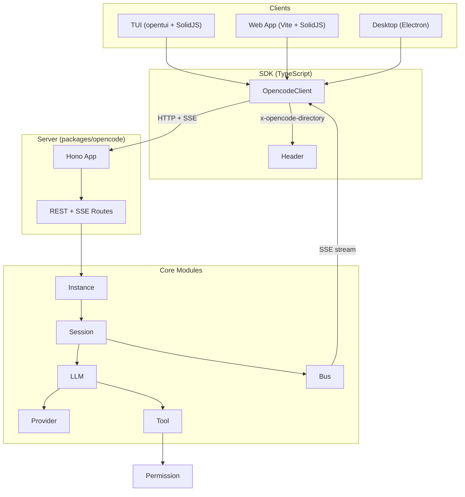

## Monorepo Structure

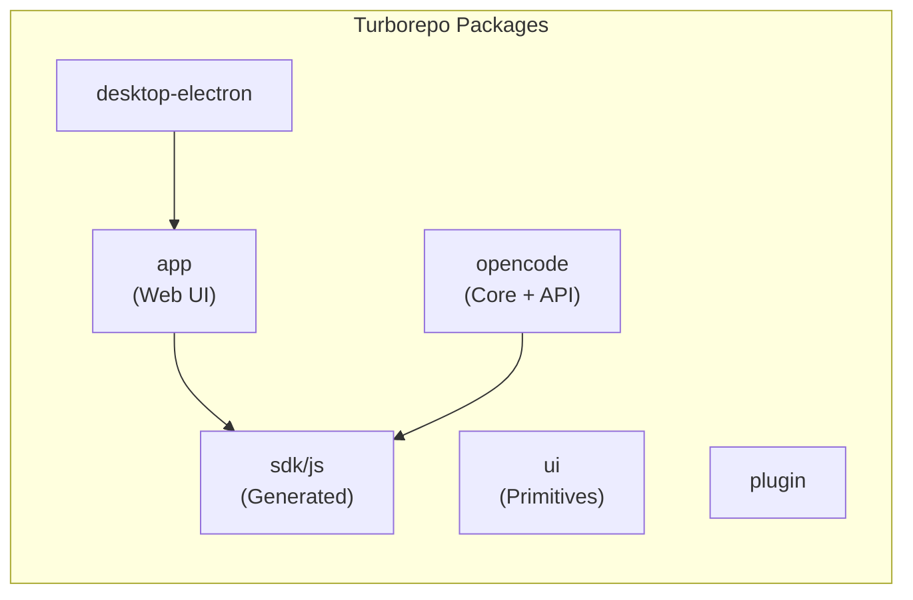

## Project & Workspace Model

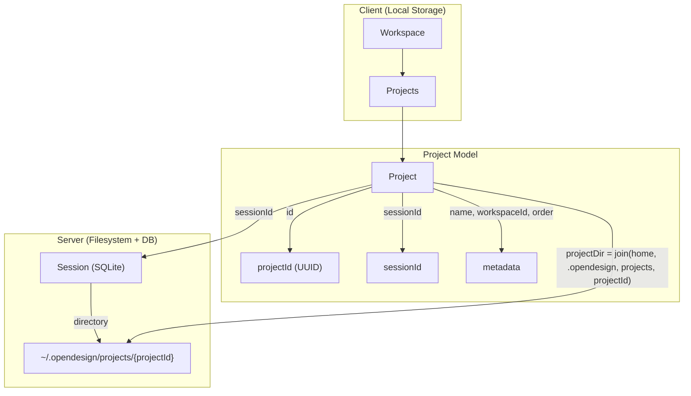

## Project Pool (Instant Switching)

Project switching uses **component pooling** so up to 4 projects stay mounted; switching only changes visibility, not the DOM tree. This keeps Figma webviews, session state, and SSE connections alive for instant feedback.

### Architecture

```
ProjectPoolProvider → ProjectPool (accepts content: Component)
  → Key each={keys()} by={k=>k}
    → ProjectShell (position:absolute, visibility/opacity when inactive)
      → ProjectScopeProvider + ActiveContext
        → SDKProvider (active gate for SSE; client depends only on directory)
        → SyncProvider → PoolProjectData
          → Dynamic component={content}   ← each slot gets its own instance
            → TerminalProvider → FileProvider → PromptProvider → CommentsProvider → Session
```

**Important:** `ProjectPool` accepts a component reference (`content: Component`), not JSX children. `Dynamic` instantiates a separate component tree per pool slot. This ensures each slot has its own independent provider chain and DOM tree — switching projects only toggles `ProjectShell` visibility without unmounting/remounting any content.

### Key Design Decisions

| Decision | Rationale |
|----------|-----------|
| **LRU pool, max 4** | Keeps memory bounded while allowing fast switching between recent projects. Active project is never evicted. |
| **Z-index stacking (no opacity/visibility)** | Avoids `display: none`, `visibility: hidden`, AND `opacity: 0`. Electron webviews inside parents with any of these get GC'd or detach their renderer ([electron/electron#764](https://github.com/electron/electron/issues/764)). Active shell gets `z-index: 1`, inactive shells get `z-index: 0`. Session content has an opaque background that naturally covers inactive shells. |
| **`inert` + `aria-hidden` on inactive** | Keeps inactive shells non-focusable and hidden from assistive tech. |
| **SDKProvider `active` gate** | SSE subscriptions only run for the active project. Client memo depends only on `directory()`, not `sessionId`. |
| **FileProvider `useProjectScope`** | File watchers pause when inactive to avoid wasted work. |
| **FigmaWebviewHost outside Tabs** | Kobalte Tabs use `display:none` for inactive content, which would GC the webview. Portal the webview into a host div that uses `z-index: -1` when the Figma tab is inactive (behind parent background, invisible to the user but "visible" to Electron's renderer — keeps it alive without reloads). |
| **`useProjectParams()` in pool children** | Components inside pool slots must use `useProjectParams()` (from `ProjectScopeProvider`) instead of `useParams()` (from router). Router params only reflect the active project; inactive slots reading router params would get wrong data. |
| **Figma host `top-12`** | Positions the Figma area below the tab bar to avoid overlap/stacking. |

### Files

| Path | Purpose |
|------|---------|
| `packages/app/src/pool/project-pool.ts` | LRU pool: `activate`, `evict`, `getCached`, `getActive` |
| `packages/app/src/pool/project-pool-context.tsx` | `ProjectPoolProvider`, `useProjectPool` |
| `packages/app/src/context/project-scope.tsx` | `ProjectScopeProvider`, `useProjectScope`, `useProjectParams` |
| `packages/app/src/components/project-shell.tsx` | Shell wrapper: inert, visibility, `ActiveContext` |
| `packages/app/src/components/project-pool.tsx` | Route-based pool; renders shells for cached keys |
| `packages/app/src/pages/session/figma-tab-content.tsx` | Figma embed (webview/iframe) |
| `packages/app/src/pages/session/session-side-panel.tsx` | Defines `FigmaWebviewHost`; portaled webview for instant tab switching |

### Eviction & Cleanup

On eviction, `layout.projectCache.drop(keys)`, `dropSessionCaches`, and `sync.session.evict()` are called so stale data is released. Evicted projects unmount; switching back re-mounts and may need to reload (Figma, etc.).

---

## Request Flow: Directory Scoping

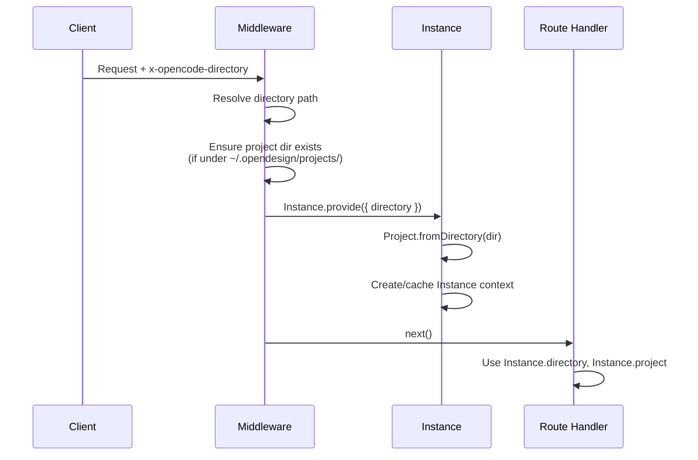

## Add Project Flow

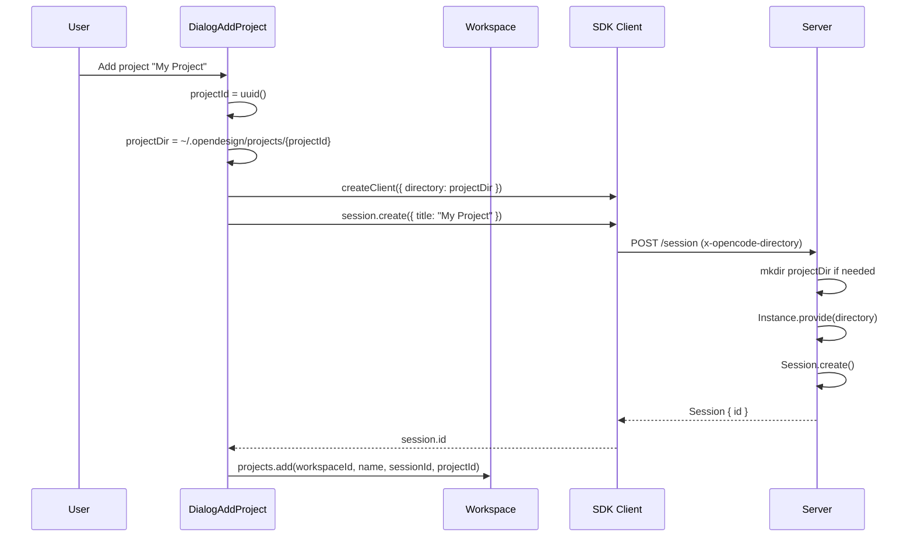

## Message / Prompt Flow

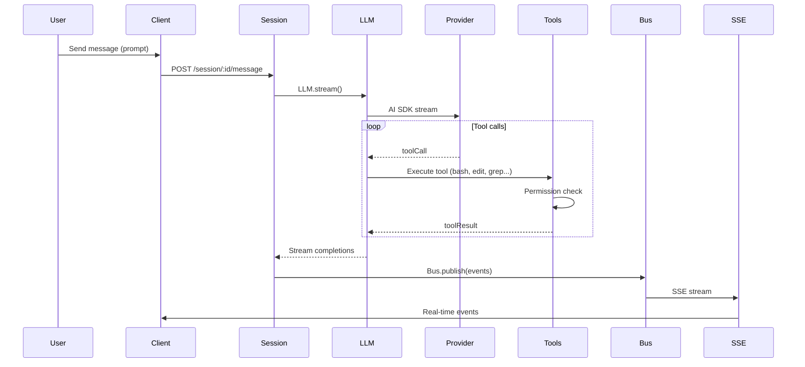

## Session & Instance Lifecycle

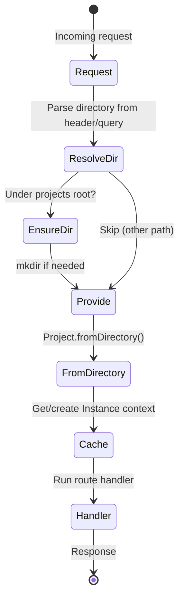

## Event Bus → SSE Pipeline

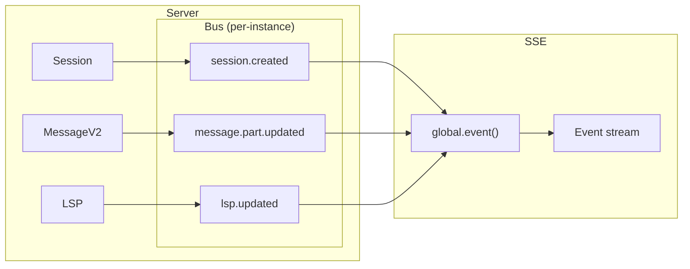
