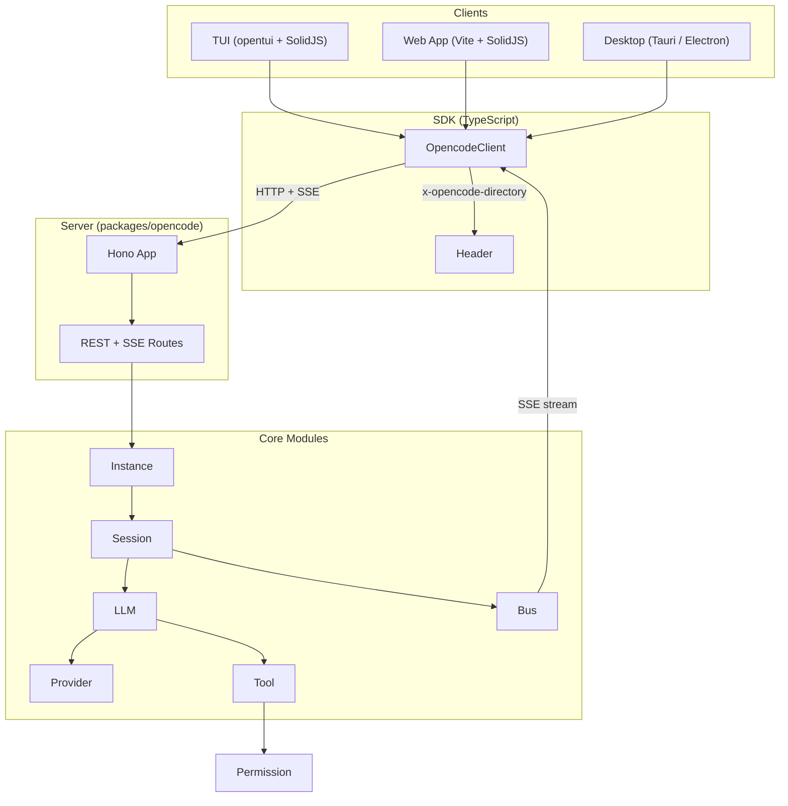
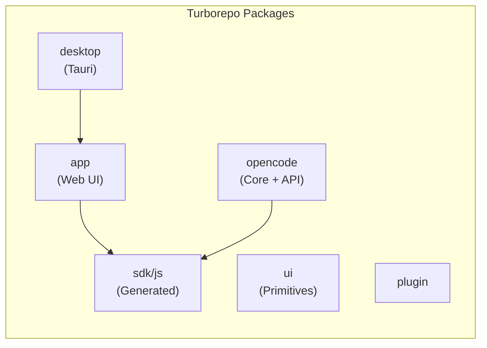
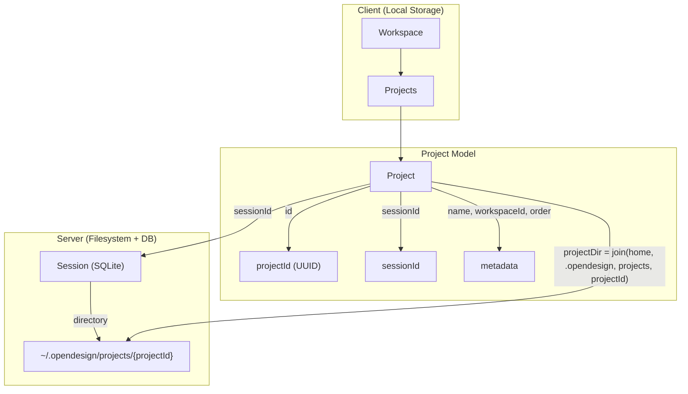
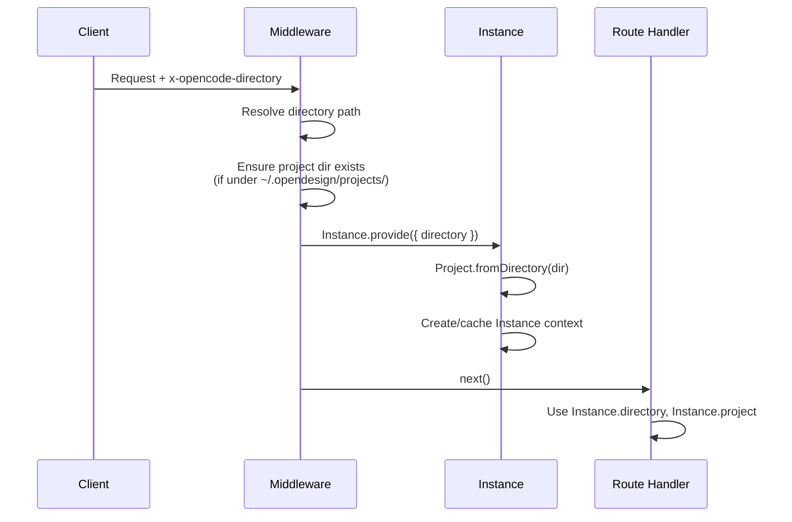
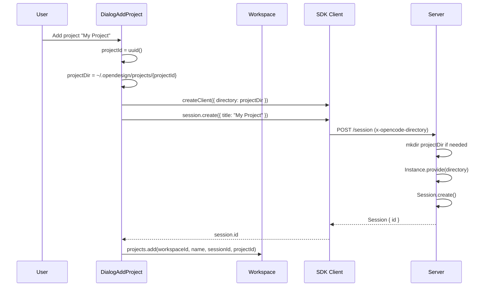
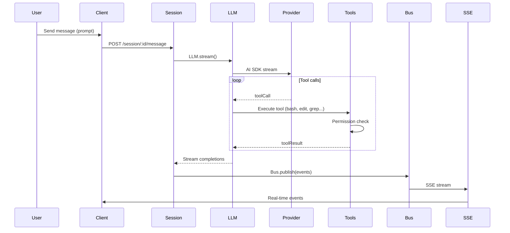
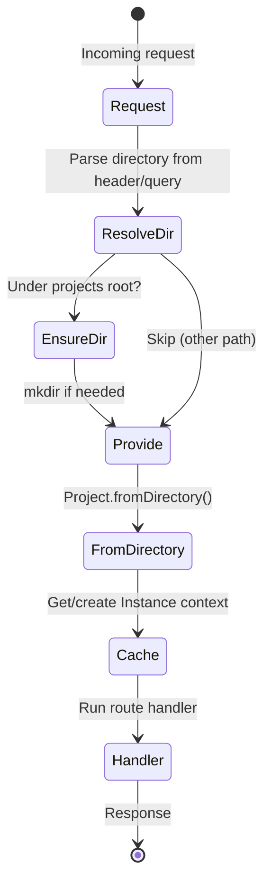
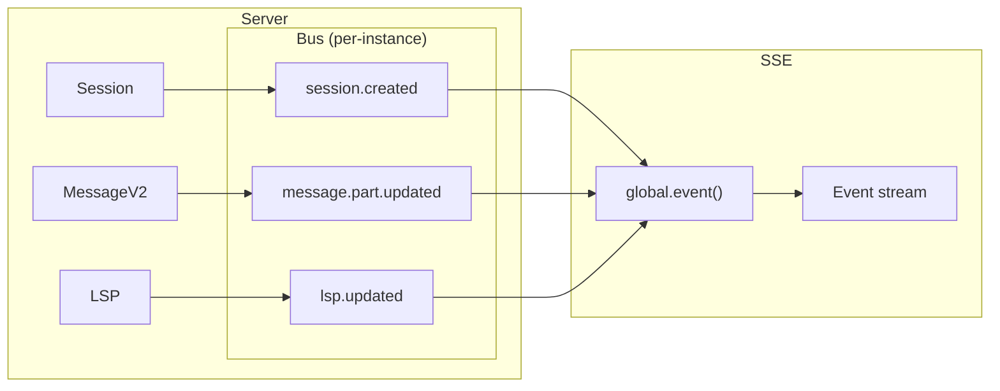

# OpenDesign / OpenCode Architecture & Data Flow

## High-Level Architecture

## Monorepo Structure

## Project & Workspace Model

## Request Flow: Directory Scoping

## Add Project Flow

## Message / Prompt Flow

## Session & Instance Lifecycle

## Event Bus → SSE Pipeline

